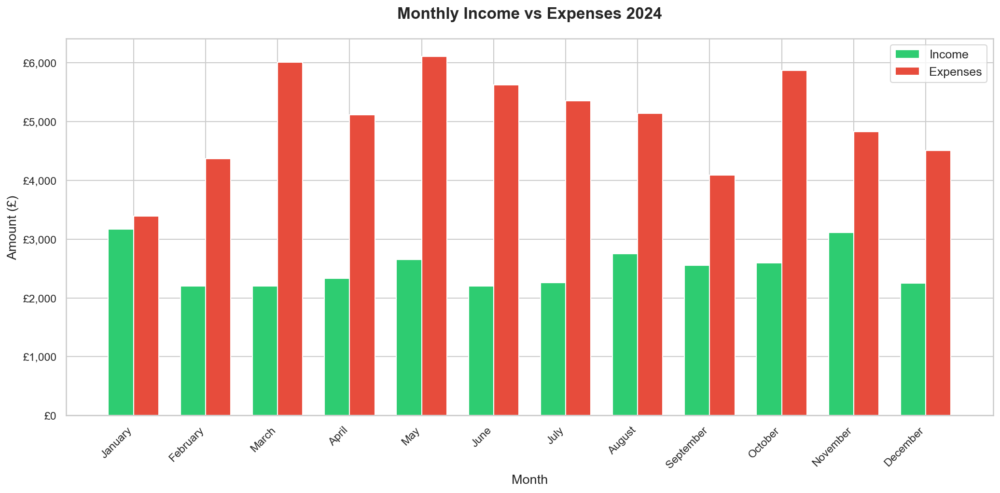
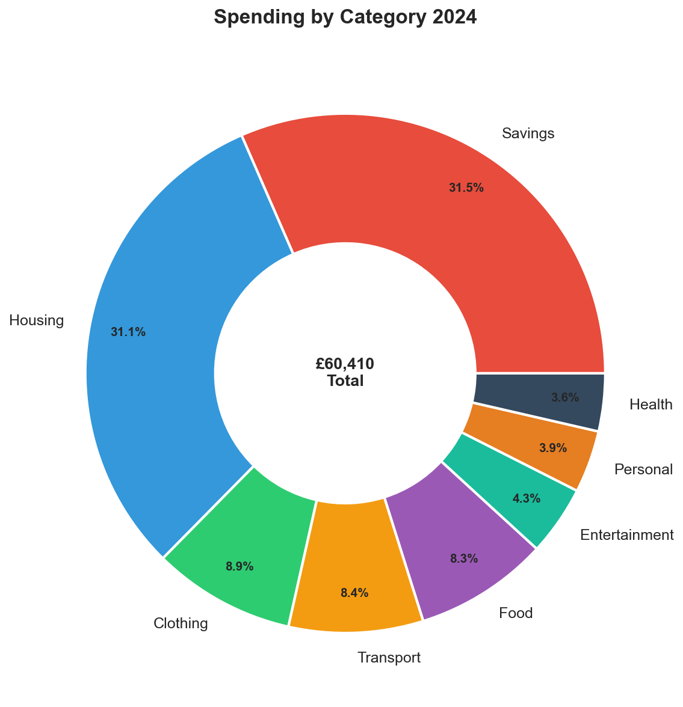
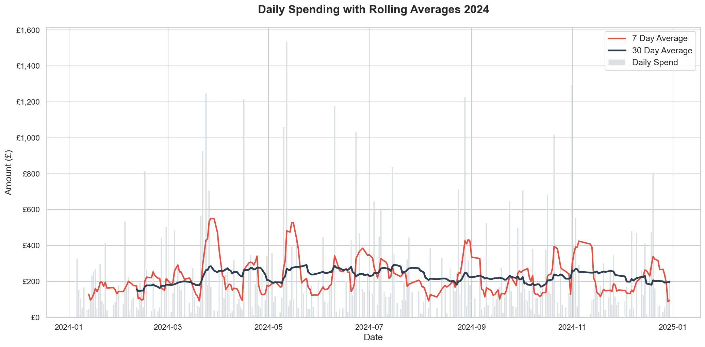
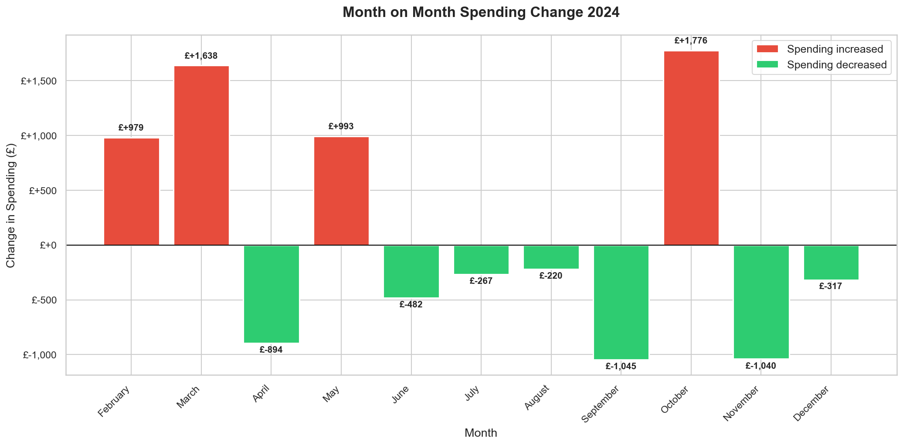
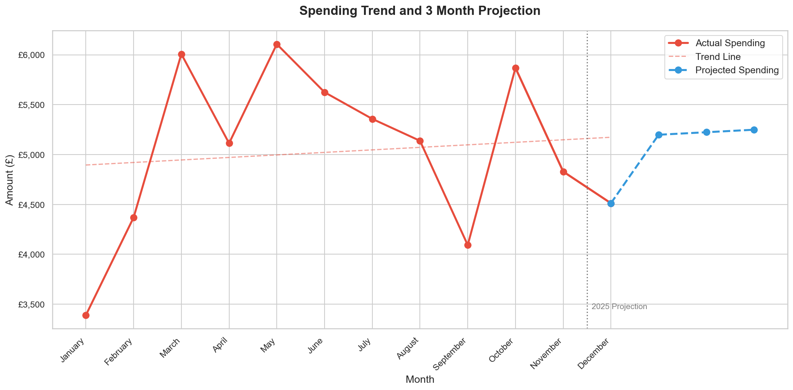

# Personal Finance Analyser

A end-to-end personal finance data analysis project built with Python and SQL. This project demonstrates the full data analyst workflow — from data generation and cleaning through to SQL querying, statistical analysis and visualisation.

---

## Project Overview

This project analyses 12 months of personal finance data (January–December 2024), covering income, expenses and savings across 8 spending categories. The goal is to identify spending patterns, calculate savings rates and project future spending trends.

---

## Tools and Technologies

- **Python** — data generation, cleaning and analysis
- **Pandas** — data manipulation and aggregation
- **NumPy** — statistical calculations and projections
- **Matplotlib / Seaborn** — data visualisation
- **SQL / SQLite** — querying and summarising data
- **Jupyter Notebooks** — interactive analysis and documentation
- **Git / GitHub** — version control

---

## Repository Structure
```
personal-finance-analyser/
├── data/
│   ├── transactions_raw.csv       # Generated raw dataset
│   ├── transactions_cleaned.csv   # Cleaned dataset
│   ├── monthly_summary.csv        # Monthly analysis output
│   └── category_breakdown.csv     # Category analysis output
├── notebooks/
│   ├── generate_data.py           # Synthetic data generation script
│   ├── 01_data_cleaning.ipynb     # Data cleaning notebook
│   ├── 02_sql_analysis.ipynb      # SQL analysis notebook
│   ├── 03_python_analysis.ipynb   # Python analysis notebook
│   └── 04_visualisations.ipynb    # Visualisations notebook
├── sql/
│   ├── 01_total_per_category.sql
│   ├── 02_monthly_income_vs_expenses.sql
│   ├── 03_top_10_expenses.sql
│   ├── 04_highest_spending_month.sql
│   ├── 05_monthly_savings_rate.sql
│   └── 06_avg_transaction_per_category.sql
├── visualisations/
│   ├── 01_monthly_income_vs_expenses.png
│   ├── 02_spending_by_category.png
│   ├── 03_daily_spending_rolling_average.png
│   ├── 04_month_on_month_change.png
│   └── 05_spending_projection.png
├── .gitignore
└── requirements.txt
```

---

## Key Findings

### Spending vs Income
- Total 2024 income: **£30,281**
- Total 2024 expenses: **£60,410**
- Average monthly deficit: **-£2,511**
- Expenses consistently exceeded income every month of the year

### Biggest Spending Categories
- **Savings transfers** accounted for 31.5% of all outgoings (£19,052)
- **Housing** accounted for 31.1% of all outgoings (£18,777)
- Together, savings and housing represented **62.6%** of total spend

### Monthly Trends
- **March** was the highest spending month at £6,008
- **January** was the lowest spending month at £3,390
- Spending is trending upward at **£25 per month**

### Projections
- Projected spending for Q1 2025: **£5,198 / £5,224 / £5,249**
- Without income growth, the monthly deficit is forecast to widen

---

## Visualisations

### Monthly Income vs Expenses


### Spending by Category


### Daily Spending with Rolling Averages


### Month on Month Spending Change


### Spending Projection


---

## How to Run

1. Clone the repository
2. Create and activate a virtual environment
3. Install dependencies with `pip install -r requirements.txt`
4. Run notebooks in order starting with `generate_data.py`

---

## About

Built as a portfolio project to demonstrate data analysis skills including 
data cleaning, SQL querying, statistical analysis and visualisation. 
Developed using VS Code with AI-assisted guidance, following industry-standard 
workflows and best practices.
